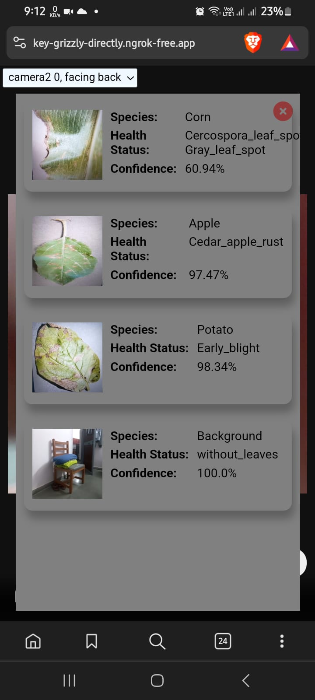

## Overview
The Plant Disease Detection App is an innovative solution that helps farmers identify diseases in their crops early, allowing for timely intervention. By leveraging machine learning techniques, this app analyzes images of plant leaves and provides accurate disease predictions.

Features
<ol type='1'>
<li>Image Upload: Users can upload images of plant leaves directly through the app.</li>
<li>Disease Prediction: The app processes the uploaded image and predicts the type of disease affecting the plant.</li>
<li>Visual Feedback: The prediction results are displayed alongside the input image, making it easy for users to understand.</li>
</ol>

## How It Works?
Frontend:
The frontend is built using modern web technologies such as HTML5, CSS and Javascript. It provides a user-friendly interface for interacting with the app. This app is suitable for both desktop and Mobile devices. Even for low end devices.  
Here’s a sneak peek of the frontend: 
 
                                               
   

 
Image Processing:
When a user captures or uploads an image, the frontend sends it to the backend for analysis.
The backend processes the image using a pre-trained deep learning model (such as a convolutional neural network) specifically trained for plant disease classification.

Backend:
The backend is responsible for handling image processing, model inference, and returning the prediction results.
You can use diagrams or flowcharts to illustrate how data flows from the frontend to the backend and back.
Briefly mention the technologies you’ve used for the backend (e.g., PHP server) and any cloud services (like Heroku ) you’ve integrated.

Prediction Results:
Once the backend processes the image, it returns the predicted disease class (e.g., “Powdery Mildew,” “Rust,” “Bacterial Blight”) to the frontend.
The frontend displays this information to the user.